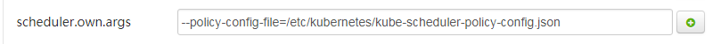

[TOC]

# 套件FloatingIP配置

## 1. 手写IP配置

### 套件配置apiswitch ip池


```
"ipam":{
	"floatingips": [{
		"routableSubnet": "10.56.19.192/26",
		"ips": ["10.56.19.238~10.56.19.247"],
		"subnet": "10.56.19.192/26",
		"gateway": "10.56.19.193"
	}, {
		"routableSubnet": "10.175.106.128/26",
		"ips": ["10.175.198.2~10.175.198.3", "10.175.198.8~10.175.198.11", "10.175.198.23~10.175.198.184"],
		"subnet": "10.175.198.0/24",
		"gateway": "10.175.198.1",
		"vlan": 3
	}]
}
```

### 套件配置kube-scheduler rackfilter配置项



scheduler.own.args增加参数：

```
--policy-config-file=/etc/kubernetes/kube-scheduler-policy-config.json
```


scheduler-policy-env-template配置框中填入以下样例

```
{
	"kind": "Policy",
	"apiVersion": "v1",
	"predicates": [
		{"name": "NoDiskConflict"}, 
		{"name": "NoVolumeZoneConflict"}, 
		{"name": "PodFitsHostPorts"}, 
		{"name": "PodFitsResources"}, 
		{"name": "PodFitsLocalDisk"}, 
		{"name": "HostName"}, 
		{"name": "MatchNodeSelector"}, 
		{"name": "PodToleratesNodeTaints"}, 
		{"name": "CheckNodeMemoryPressure"}, 
		{"name": "CheckNodeDiskPressure"}, 
		{"name": "MatchInterPodAffinity"}
	],
	"priorities": [
		{"name": "LeastRequestedPriority", "weight": 1}, 
		{"name": "BalancedResourceAllocation", "weight": 1}, 
		{"name": "ServiceSpreadingPriority", "weight": 1}, 
		{"name": "NodePreferAvoidPodsPriority", "weight": 10000}, 
		{"name": "NodeAffinityPriority", "weight": 1}, 
		{"name": "TaintTolerationPriority", "weight": 1}, 
		{"name": "InterPodAffinityPriority", "weight": 1}
	],
	"builtin_extenders": [{
		"name": "RackFilter",
		"conf": {
			"rackConstraints": {
				"10.175.106.128-26": 168,
				"10.175.106.192-26": 96
			},
			"rackSelector": {
				"10.175.106.128-26": {
					"subnet": "10.175.106.128-26"
				},
				"10.175.106.192-26": {
					"subnet": "10.175.106.192-26"
				}
			},
			"podSelector": {
				"network": "FLOATINGIP"
			}
		}
	}]
}
```

## 2. 自动从cmdb获取配置

扩容、缩容机器后需要重启apiswitch和kube-scheduler，apiswitch从k8s读取所有计算节点的ip后，会自动从cmdb拉取可以给容器用的ip（不论ip与物理机固资绑定或者与VM固资绑定，都可以拉取到），并生成kube-scheduler rackfilter插件的配置文件写入configmap

### 套件配置apiswitch参数


套件上设置floatingip.from为1

### 套件配置kube-scheduler从configmap读取rackfilter配置


scheduler.own.args增加参数：

```
--policy-config-file=/etc/kubernetes/kube-scheduler-policy-config.json
```


scheduler-policy-env-template配置框中填入以下配置

```
{
	"kind": "Policy",
	"apiVersion": "v1",
	"predicates": [
		{"name": "NoDiskConflict"}, 
		{"name": "NoVolumeZoneConflict"}, 
		{"name": "PodFitsHostPorts"}, 
		{"name": "PodFitsResources"}, 
		{"name": "PodFitsLocalDisk"}, 
		{"name": "HostName"}, 
		{"name": "MatchNodeSelector"}, 
		{"name": "PodToleratesNodeTaints"}, 
		{"name": "CheckNodeMemoryPressure"}, 
		{"name": "CheckNodeDiskPressure"}, 
		{"name": "MatchInterPodAffinity"}
	],
	"priorities": [
		{"name": "LeastRequestedPriority", "weight": 1}, 
		{"name": "BalancedResourceAllocation", "weight": 1}, 
		{"name": "ServiceSpreadingPriority", "weight": 1}, 
		{"name": "NodePreferAvoidPodsPriority", "weight": 10000}, 
		{"name": "NodeAffinityPriority", "weight": 1}, 
		{"name": "TaintTolerationPriority", "weight": 1}, 
		{"name": "InterPodAffinityPriority", "weight": 1}
	],
	"builtin_extenders": [{
		"name": "RackFilter",
		"conf": {
			"fromConfigMap": true,
			"configMapName": "floatingip-config",
			"configMapNamespace": "kube-system",
			"configMapDataKey": "scheduler-plugin-config",
			"podSelector": {
				"network": "FLOATINGIP"
			}
		}
	}]
}
```

### 自动生成的configmap示例

```
kubectl get cm -o json floatingip-config  -n kube-system                                                                                                            
{
    "kind": "ConfigMap",
    "apiVersion": "v1",
    "metadata": {
        "name": "floatingip-config",
        "namespace": "kube-system",
        "selfLink": "/api/v1/namespaces/kube-system/configmaps/floatingip-config",
        "uid": "2a3eee5b-0722-11e8-9fe4-200bc79a1e73",
        "resourceVersion": "800403194",
        "creationTimestamp": "2018-02-01T07:33:15Z"
    },
    "data": {
        "floatingips": "[{\"routableSubnet\":\"10.175.106.128/26\",\"ips\":[\"10.175.198.2~10.175.198.184\"],\"subnet\":\"10.175.198.0/24\",\"gateway\":\"10.175.198.1\"},{\"routableSubnet\":\"10.175.106.192/26\",\"ips\":[\"10.175.199.2~10.175.199.112\"],\"subnet\":\"10.175.199.0/24\",\"gateway\":\"10.175.199.1\"},{\"routableSubnet\":\"10.175.107.0/26\",\"ips\":[\"10.175.200.2~10.175.200.25\"],\"subnet\":\"10.175.200.0/24\",\"gateway\":\"10.175.200.1\"},{\"routableSubnet\":\"10.240.109.192/26\",\"ips\":[\"10.240.109.240~10.240.109.249\"],\"subnet\":\"10.240.109.192/26\",\"gateway\":\"10.240.109.193\"},{\"routableSubnet\":\"10.240.92.64/26\",\"ips\":[\"10.240.92.93\",\"10.240.92.96\",\"10.240.92.104\",\"10.240.92.108~10.240.92.110\",\"10.240.92.118~10.240.92.121\"],\"subnet\":\"10.240.92.64/26\",\"gateway\":\"10.240.92.65\"},{\"routableSubnet\":\"10.56.19.128/26\",\"ips\":[\"10.56.19.174~10.56.19.183\"],\"subnet\":\"10.56.19.128/26\",\"gateway\":\"10.56.19.129\"},{\"routableSubnet\":\"10.56.82.192/26\",\"ips\":[\"10.56.82.238~10.56.82.247\"],\"subnet\":\"10.56.82.192/26\",\"gateway\":\"10.56.82.193\"},{\"routableSubnet\":\"10.56.16.128/26\",\"ips\":[\"10.56.58.64~10.56.58.87\"],\"subnet\":\"10.56.58.0/23\",\"gateway\":\"10.56.58.1\"},{\"routableSubnet\":\"10.240.92.0/26\",\"ips\":[\"10.240.92.48~10.240.92.57\"],\"subnet\":\"10.240.92.0/26\",\"gateway\":\"10.240.92.1\"},{\"routableSubnet\":\"10.56.19.192/26\",\"ips\":[\"10.56.19.238~10.56.19.247\"],\"subnet\":\"10.56.19.192/26\",\"gateway\":\"10.56.19.193\"}]",
        "scheduler-plugin-config": "{\"rackConstraints\":{\"10.175.106.128-26\":183,\"10.175.106.192-26\":111,\"10.175.107.0-26\":24,\"10.240.109.192-26\":10,\"10.240.92.0-26\":10,\"10.240.92.64-26\":10,\"10.56.16.128-26\":24,\"10.56.19.128-26\":10,\"10.56.19.192-26\":10,\"10.56.82.192-26\":10},\"rackSelector\":{\"10.175.106.128-26\":{\"subnet\":\"10.175.106.128-26\"},\"10.175.106.192-26\":{\"subnet\":\"10.175.106.192-26\"},\"10.175.107.0-26\":{\"subnet\":\"10.175.107.0-26\"},\"10.240.109.192-26\":{\"subnet\":\"10.240.109.192-26\"},\"10.240.92.0-26\":{\"subnet\":\"10.240.92.0-26\"},\"10.240.92.64-26\":{\"subnet\":\"10.240.92.64-26\"},\"10.56.16.128-26\":{\"subnet\":\"10.56.16.128-26\"},\"10.56.19.128-26\":{\"subnet\":\"10.56.19.128-26\"},\"10.56.19.192-26\":{\"subnet\":\"10.56.19.192-26\"},\"10.56.82.192-26\":{\"subnet\":\"10.56.82.192-26\"}},\"podSelector\":{\"network\":\"FLOATINGIP\"}}"
    }
}
```

