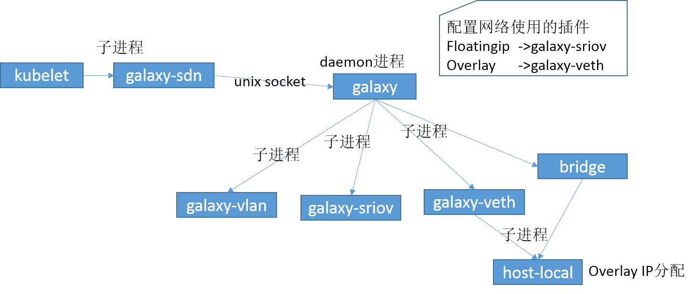
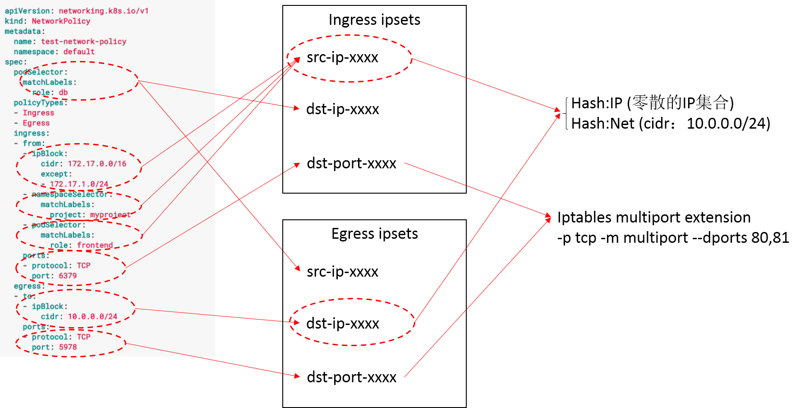
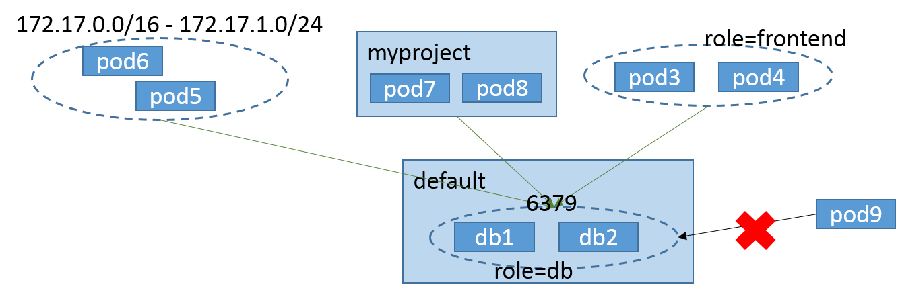

[TOC]

# Galaxy网络插件

Galaxy是实现CNI标准的网络插件

## 为啥要启动子进程？

Golang 1.10才能保证goroutine切换namespace的安全性 [https://github.com/vishvananda/netns/issues/17](https://github.com/vishvananda/netns/issues/17)

# Galaxy-ipam scheduler extender

Galaxy-ipam是调度器插件，实现Floating IP的分配，回收和漂移

# Network policy

Network policy很灵活，不仅可以支持多租户网络策略，还可以精确到Pod级别的网络策略。
由于Network policy中的Pod IP集合可能非常多，用纯iptables实现，规则会非常多，顺序遍历时间复杂度较高，需要借助ipset提供IP的Hash查询功能。

## ingress iptables设计

## egress iptables设计

